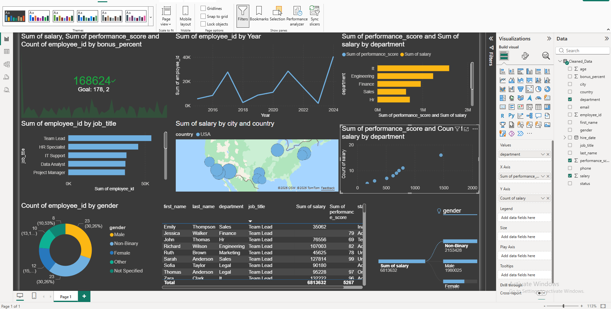

# 🚀 HR Analytics Dashboard Project

### From Messy Data → Clean Dataset → Interactive Power BI Dashboard

---

## 📌 Overview

This project demonstrates a complete **end-to-end data analytics workflow**, transforming raw, unstructured employee data into a clean, analysis-ready dataset and building an interactive HR dashboard.

It showcases skills in:

* Data cleaning & preprocessing
* Data transformation using Python
* Data modeling & visualization
* Business insight generation

---

## 🎯 Project Objective

To simulate a real-world business scenario where messy HR data is cleaned and transformed into meaningful insights that support decision-making.

---

## 📂 Dataset

* Source: `messy_employee_data.xlsx`
* Sheet Used: `Employee_Data_RAW`

The dataset initially contained:

* Inconsistent column names
* Missing values
* Duplicate records
* Incorrect data formats
* Invalid entries (emails, phone numbers, etc.)

---

## 🧹 Data Cleaning Process

### 1. Column Standardization

* Removed extra spaces
* Converted all column names to lowercase
* Replaced spaces with underscores
* Renamed inconsistent columns

---

### 2. Removing Invalid Data

* Dropped completely empty rows
* Removed rows containing placeholder values (`---`)
* Removed duplicate employee records

---

### 3. Data Type & Format Cleaning

#### 👤 Employee ID

* Removed prefixes (`EMP-`)
* Converted to consistent format

#### 🧑 Names

* Trimmed spaces
* Standardized capitalization

#### 📧 Email

* Converted to lowercase
* Removed invalid entries

#### 📞 Phone Numbers

* Extracted digits only
* Standardized format: `XXX-XXX-XXXX`

---

### 4. Data Normalization

#### 💰 Salary

* Removed symbols (`$`, `,`)
* Converted to numeric format

#### 📅 Hire Date

* Converted to standard date format (`YYYY-MM-DD`)

#### 🏢 Department

* Standardized naming (title case)

#### 🌍 Location

* Cleaned city names (e.g., "nyc" → "New York")
* Standardized country names (e.g., "us", "usa" → "USA")

---

### 5. Data Validation Rules

#### 📊 Performance Score

* Ensured values between 0–100

#### 🎁 Bonus Percentage

* Handled missing and invalid values
* Defaulted to 0 where necessary

#### 🎂 Age

* Valid range enforced (18–75)

#### ⚧ Gender

* Standardized categories:

  * Male
  * Female
  * Non-Binary
  * Other
  * Not Specified

#### 📌 Status

* Cleaned into:

  * Active
  * Inactive
  * On Leave
  * Terminated
  * Unknown

---

## 💾 Output

* Cleaned dataset saved as:
  **`cleaned_employee_data.xlsx`**

---

## 📊 Dashboard Features

The cleaned dataset was used to build an **interactive HR Analytics Dashboard** with the following insights:

### 🔝 Key Metrics (KPIs)

* Total Employees
* Average Salary
* Average Performance Score
* Average Bonus Percentage

---

### 📈 Visual Insights

* Hiring trends over time
* Department-wise employee distribution
* Salary vs performance analysis
* Top job roles by employee count
* Gender distribution
* Geographic employee distribution

---

### 🎛️ Interactivity

* Filters (Department, Gender, Country, Status)
* Drill-down capabilities
* Dynamic visuals responding to user input

---

## 🧠 Key Insights Derived

* Identification of top-performing departments
* Salary distribution patterns across roles
* Workforce composition by region and gender
* Relationship between salary and performance
* Hiring trends over time

---

## 🛠️ Technologies Used

* **Python**

  * pandas
  * re (regex)
* **Excel**
* **Power BI**

---

## ⚙️ How to Run the Project

### 1. Install Dependencies

```bash
pip install pandas openpyxl
```

### 2. Run the Script

```bash
python your_script_name.py
```

### 3. Output

* Clean dataset will be generated automatically

---

## 💡 Why This Project Matters

This project demonstrates the ability to:

* Handle real-world messy datasets
* Apply data cleaning best practices
* Transform raw data into business insights
* Build professional dashboards

---

## 🚀 Future Improvements

* Add predictive analytics (employee attrition)
* Integrate real-time data sources
* Enhance dashboard storytelling
* Deploy dashboard to cloud platforms

---

## 📬 Contact

If you're a recruiter or collaborator interested in this project, feel free to connect!

---

⭐ *If you found this project valuable, consider giving it a star!*



